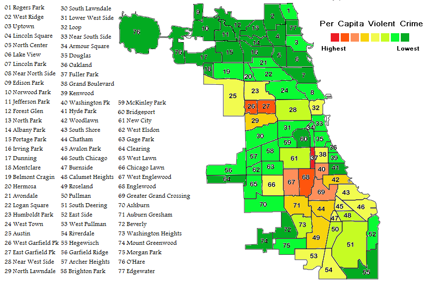
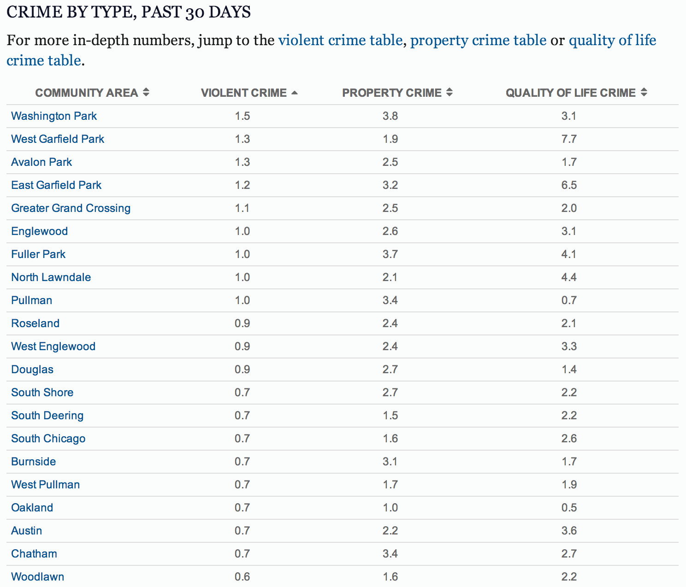

Maps
====

When to make a map, and when not to
-----------------------------------

The most important question to ask when you're about to build an interactive map is, Why? Not every
project that can be mapped is best served with one. For instance, if you're trying to compare the
homicide rate across different neighborhoods in a city, simply displaying a map of the neighborhoods
with each one shaded according to the rate may not be that effective.

Consider two ways of visualizing the same data, violent crime rate by Chicago community area:

The map is the prettier choice, certainly. But does it more effectively convey data about relative
crime rates? Beyond answering the basic question, "Where in physical space do more violent crimes
occur?" it doesn't tell the reader much at all, and hides almost all detail. It doesn't even
effectively address the most basic question, "What community area has the highest or lowest violent
crime rate?" It certainly doesn't allow the reader to compare any two neighborhoods, unless they
happen to be close enough together to allow for fuzzy comparisons about which color is slightly
darker.

The point is, maps are often the first choice when looking to visualize some data, but they're not
always the best choice. Before you decide to build a map at all, think carefully about what you want
readers to understand about the data you're presenting, and whether a map is the clearest expression
of that intention.

How to use Leaflet.js
---------------------

Now that you've carefully pondered your options and concluded that a map is the best choice to
visualize your data, it's time to start building it. There are an incredible number of choices here,
but we're going to walk you through building a map using `Leaflet.js <http://leafletjs.com/>`_.
We prefer to use Leaflet whenever possible because it's responsive by default, allows for the use
of arbitrary tilesets and data providers, has `good documentation online
<http://leafletjs.com/reference.html>`_, is generally very flexible and powerful, and works across
a wide array of browsers and platforms.

To get started, first include the Leaflet CSS and JS files:

.. code-block:: html

    <link rel="stylesheet" href="http://cdn.leafletjs.com/leaflet-0.7.1/leaflet.css" />
    <!--[if lte IE 8]>
        <link rel="stylesheet" href="http://cdn.leafletjs.com/leaflet-0.7.1/leaflet.ie.css" />
    <![endif]-->
    

You'll also need a ``
`` element on the page with an id (it can be anything; we'll use "map" for
this example) and a defined height:

.. code-block:: html

    
    

We're also going to assume you're using `jQuery <http://jquery.com/>`_, a very powerful and flexible
library; we'll mainly use it here to wait for the page to finish loading before we build our map.

.. code-block:: javascript

    $(document).ready(function() {
        // Code you put here won't run until the page is finished loading
        // So for now, put all your mapping code here - though you'll eventually want to decompose
        // it into separate functions before it becomes unmanageably large.
    });

When we include leaflet.js on the page, it will create an object in Javascript named ``L`` that
allows us to access all the leaflet functionality we need. We begin by creating a map object and
tying it to the "map" ``
`` we created above.

.. code-block:: javascript

    var map = L.map('map');

Leaflet needs to know where to center the map, and what zoom level to start out at. Let's give it
the latitude and longitude coordinates for Chicago, and zoom it to a level that lets us see some
detail about the city; higher numbers indicate zooming in farther and farther, showing more detail.
We typically don't allow zooming in beyond level 16, or zooming out beyond level 9, but that varies
greatly depending on the size of your map and the geographic area you're covering).

.. code-block:: javascript

    map.setView([41.838299, -87.706953], 11);

Using Chicago's tileset
-----------------------

Blah.

Basic interactive map example
-----------------------------

Blah.

Tarbell example
---------------

Blah.
