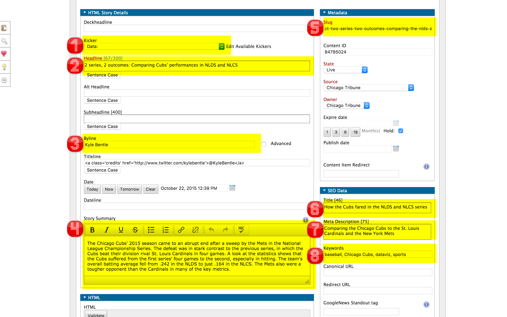

Consuming and publishing to P2P
===============================

Other documentation
-------------------

* `Content Services API Documentation <https://content-api.p2p.tribuneinteractive.com/docs/>`_

Installing p2p-python
---------------------

To work with P2P content, you'll need to install the `p2p-python` module. In a terminal, run:

`pip install -e git://github.com/newsapps/p2p-python.git@507ef41f44f8dd53f60cc6ffb9c252fdf8d559d0#egg=p2p_tribune-dev`

This will give you access to the `p2p` module. With this, you can import and work with content
that has been created in P2P as long as you have the slug.

Using p2p-python
----------------
TK -- This should be a short couple of grafs that links off to the TK github readme. Include stuff like
how to import, how to set slugs, and working with images/storygalleries.

.. note::

  Find available template filters `listed here. <http://docs.tribapps.com/tarbell.html#template-filters-p2p>`_

In Tarbell
----------

When you begin a new Tarbell project, you will need to install the `p2p-python` module. Tarbell's base template will
automatically import the module and set it up for your use.

Create your content item in P2P, and then feed the slug to your Tarbell template::

  

This will create a variable `story` that contains the article available at the slug you chose. To display the text,
simply call the `body` attribute::

  {{ story.body }}

Now, suppose you don't want one big chunk of text, but would like to integrate pictures, pull quotes, videos, etc.
With a few filters applied to `story.body`, you can break it into individual paragraphs to place at will::

  
  
      
{{ p|striptags|process_text }}

  

This block of code creates an array of paragraphs, meaning we can use a for loop to iterate over a chosen
number of paragraphs at a time. Note that the paragraphs' numbering starts at 0, and that the for loop quits when it hits the
paragraph mentioned after the colon. So, in the example above, only the very first paragraph of the story is printed.

.. note::

  For more information about the filters used here, refer to the `Tarbell template filters page <http://docs.tribapps.com/tarbell.html#template-filters>`_

Here is a fuller example::

			
				
{{ p|striptags|process_text }}

			

      

			
				{{ p|process_text }}
			

      

				<aside>
					<h3 class="video-head">{{ video1_headline }}</h3>
					

						<iframe src="//player.vimeo.com/video/86333422" width="500" height="281" frameborder="0" webkitallowfullscreen mozallowfullscreen allowfullscreen></iframe>
					

				</aside>
			

			
				{{ p|process_text }}
			

Big gallery macro
-----------------

The gallery macro in the Tribune Tarbell base blueprint takes a P2P gallery slug and turns it into a big gallery on
the story page. All you need to do is feed the slug to the macro using Jinja template tags::

  {{ macros.gallery("chi-scenes-of-chicagos-austin-neighborhood-20130927", 1.5) }}

You can also populate the slug for the gallery macro with a Google spreadsheet::

  
     

        
          {{ macros.gallery(row.gallery, 1.5) }}
        
          
          <figcaption class="text-left">{{ row.imgcaption|process_text }}</figcaption>
        
      

  

Keeping things tidy in P2P
--------------------------

Sometimes, whether publishing with Tarbell or a manually-edited htmlstory, you'll post stories directly to P2P.  Here are some guidelines:

Amazon S3 Photo bucket
~~~~~~~~~~~~~~~~~~~~~~

If you are uploading more than one image you MUST put them in a folder. This folder should be reasonably similar to the p2p slug and must include the date. I don’t know if we can manage any more generically named “getting-around” folders. Things are getting pretty chaotic in the photo bucket, and the goal here is to bring some level of organization.

SEO/Other P2P fields
~~~~~~~~~~~~~~~~~~~~

Kicker
   This is a new option for us. We should select “Data” for everything we do, to brand our team’s content. (1) 

Headline
    This should be front loaded with keywords and otherwise be SEO friendly. Questions often do well here, provided our content answers the question. 77-character maximum, but ideal is 49. (2)

Byline
   Previously, we had been attributing everything to Trib Graphics, but this is changing. We should be putting our own names in a comma-separated list. As a sidetone, the titleline no longer does anything, so no need to keep putting our Twitter handle there. (3)

Story Summary
   This should favor keywords and concise writing over poetry. It's a recent addition and should be larger than the Meta Description but shorter than the main chatter. This is used throughout the site as a synopsis visible to readers but is not part of our SEO system. (4)

Slug
   This is the first layer of SEO. Should mimic the headline to some extent, but keywords here are important. (5)

SEO Title
   Should be at least very very similar to the headline. 77-character maximum, but ideal is 49. (6)

SEO Meta Description
   Should be a straight synopsis using lots of keywords and no flowery writing. This shows up in search results on Google, etc. 156-character limit. (7)

SEO keywords
   Comma-Separated list of no more than 10 words or phrases. Should be what people would actually search for. (8)

Thumbnail
    Engaging and eye-catching. Screenshots of tables of segments of a chart usually will not cut it. Find real photos or craft a collage/illustration that represents the subject matter well, but we don’t need to bend over backwards to find an image that says, for instance, "bulls graphic.” We just need to say “bulls." (not pictured)

Sending P2P stories to the copy desk
------------------------------------

After you've done initial editing on the story and filled out the metadata fields in P2P, the story is ready to be sent to the copy desk.  To do this:

* Email should be to ct-digital-editors <Ct-digital-editors@chicagotribune.com>
* Email should cc the team, zzctc-trib-dataviz <zzctc-trib-dataviz@tribpub.com>
* Subject should include a very short description of graphic story and declare it ready for editing, e.g. "Advanced Placement test scores graphic ready for editing"  
* Body should include:
    * P2P slug (if P2P story)
    * Slug of related story and any contact information for the reporter(s) for that story
    * The run date for this item or related story (if it's known)  
    * Beta link on S3 (if off-platform Tarbell project)
    * Method for editing.  In the case of a Tarbell project, this should include the Google Spreadsheet URL.  Make sure to set sharing permissions so anyone with the link can edit it. Be explicit about where to find content in different worksheets and anything that should not be edited.  Also make use of comments in the Tarbell spreadsheet to guide people as they're editing.   
    * (At least one) contact  

Depending on the deadline pressure, look for a response from the copy desk.  Someone should reply with an "I'll get this".  There's no official time frame for this reply, but if you don't get one, send a polite reply-all to your original email to make sure that the story is accounted for.  Failing that, talk to Jonathon Berlin (Dataviz editor), Ryan Marx (Dataviz assistant editor) or Stu Werner (copy desk chief).    

This is a rough outline of the process.  When in doubt, be explicit and include any and all information someone might need to edit the graphic/story.

Example email
~~~~~~~~~~~~~

This is an example email to the copy desk announcing that a story is ready for editing. 

        From: Geoff Hing <ghing@tribpub.com>

        Subject: Advanced Placement test scores graphic ready for editing

        Cc: zzctc-trib-dataviz <zzctc-trib-dataviz@tribpub.com>

        To: Ct-digital-editors <Ct-digital-editors@chicagotribune.com>

        P2P slug: ct-ap-results-schools-charts

        This is related to the story ct-ap-results-schools.  It doesn't
        look like that story is in P2P yet, but it is in NewsGate.  The reporter
        for that story is Diane Rado <drado@tribune.com>.

        The target run date appears to be fluid.

        This is a Tarbell project published to P2P.  You should not edit the
        content in P2P, but instead edit it in the Google Spreadsheet at
        https://docs.google.com/spreadsheets/d/{spreadsheet_key_obfuscated}/edit

        The headline and introductory text, chart labels and other labels are
        all set in the `values` worksheet

        The chatter for the charts that you see when you first visit the story,
        as well as the section headings are edited in the `intro_charts`
        worksheet.

        You should ignore the `interesting_schools` worksheet.

        This is for our internal use and doesn't affect anything that
        gets published.

        If you have any questions or comments contact me at ghing@tribpub.com.
