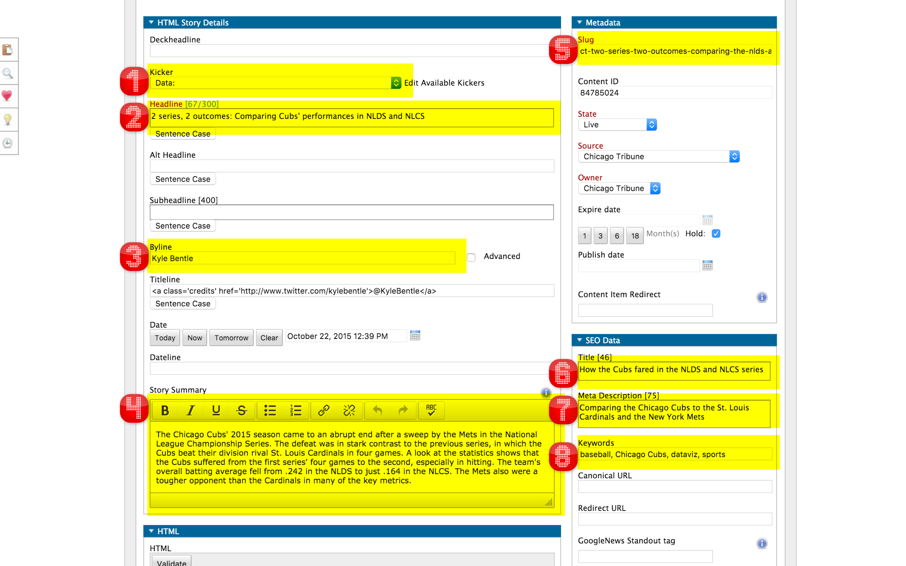

========================
P2P Publication Workflow
========================

Here are some guidlines for publishing a story in P2P, whether it's via Tarbell or through manual editing.

Keeping the Amazon S3 Photo bucket tidy
---------------------------------------

For manually-edited HTML Stories in P2P, we need to upload images to the `graphics.chicagotribune.com` S3 bucket.

If you are uploading more than one image you MUST put them in a folder. This folder should be reasonably similar to the p2p slug and must include the date. I don’t know if we can manage any more generically named “getting-around” folders. Things are getting pretty chaotic in the photo bucket, and the goal here is to bring some level of organization.

P2P Metadata fields
-------------------

In addition to the content fields, there are a number of other metadata fields that should be set in P2P to optimize SEO performance.  For Tarbell projects, these can be set in the Tarbell spreadsheet and will overwrite any values set in the P2P administration site.

Kicker
   This is a new option for us. We should select “Data” for everything we do, to brand our team’s content. (1) 

Headline
    This should be front loaded with keywords and otherwise be SEO friendly. Questions often do well here, provided our content answers the question. 77-character maximum, but ideal is 49. (2)

Byline
   Previously, we had been attributing everything to Trib Graphics, but this is changing. We should be putting our own names in a comma-separated list. As a sidetone, the titleline no longer does anything, so no need to keep putting our Twitter handle there. (3)

Story Summary
   This should favor keywords and concise writing over poetry. It's a recent addition and should be larger than the Meta Description but shorter than the main chatter. This is used throughout the site as a synopsis visible to readers but is not part of our SEO system. (4)

Slug
   This is the first layer of SEO. Should mimic the headline to some extent, but keywords here are important. (5)

SEO Title
   Should be at least very very similar to the headline. 77-character maximum, but ideal is 49. (6)

SEO Meta Description
   Should be a straight synopsis using lots of keywords and no flowery writing. This shows up in search results on Google, etc. 156-character limit. (7)

SEO keywords
   Comma-Separated list of no more than 10 words or phrases. Should be what people would actually search for. (8)

Thumbnail
    Engaging and eye-catching. Screenshots of tables of segments of a chart usually will not cut it. Find real photos or craft a collage/illustration that represents the subject matter well, but we don’t need to bend over backwards to find an image that says, for instance, "bulls graphic.” We just need to say “bulls." (not pictured)

Sending stories to the copy desk
--------------------------------

After you've done initial editing on the story and filled out the metadata fields in P2P, the story is ready to be sent to the copy desk.  To do this:

* Email should be to ct-digital-editors <Ct-digital-editors@chicagotribune.com>
* Email should cc the team, zzctc-trib-dataviz <zzctc-trib-dataviz@tribpub.com>
    * If this story accompanies another story, the email should cc the reporter and the editor for the related story.  
* Subject should include a very short description of graphic story and declare it ready for editing, e.g. "Advanced Placement test scores graphic ready for editing"  
* Body should include:
    * P2P slug (if P2P story)
    * Slug of related story and any contact information for the reporter(s) for that story
    * The run date for this item or related story (if it's known)  
    * Beta link on S3 (if off-platform Tarbell project)
    * Method for editing.  In the case of a Tarbell project, this should include the Google Spreadsheet URL.  Make sure to set sharing permissions so anyone with the link can edit it. Be explicit about where to find content in different worksheets and anything that should not be edited.  Also make use of comments in the Tarbell spreadsheet to guide people as they're editing.   
    * (At least one) contact  

Depending on the deadline pressure, look for a response from the copy desk.  Someone should reply with an "I'll get this".  There's no official time frame for this reply, but if you don't get one, send a polite reply-all to your original email to make sure that the story is accounted for.  Failing that, talk to Jonathon Berlin (Dataviz editor), Ryan Marx (Dataviz assistant editor) or Stu Werner (copy desk chief).    

This is a rough outline of the process.  When in doubt, be explicit and include any and all information someone might need to edit the graphic/story.

Example email
~~~~~~~~~~~~~

This is an example email to the copy desk announcing that a story is ready for editing. 

        From: Geoff Hing <ghing@tribpub.com>

        Subject: Advanced Placement test scores graphic ready for editing

        Cc: zzctc-trib-dataviz <zzctc-trib-dataviz@tribpub.com>

        To: Ct-digital-editors <Ct-digital-editors@chicagotribune.com>

        P2P slug: ct-ap-results-schools-charts

        This is related to the story ct-ap-results-schools.  It doesn't
        look like that story is in P2P yet, but it is in NewsGate.  The reporter
        for that story is Diane Rado <drado@tribune.com>.

        The target run date appears to be fluid.

        This is a Tarbell project published to P2P.  You should not edit the
        content in P2P, but instead edit it in the Google Spreadsheet at
        https://docs.google.com/spreadsheets/d/{spreadsheet_key_obfuscated}/edit

        The headline and introductory text, chart labels and other labels are
        all set in the `values` worksheet

        The chatter for the charts that you see when you first visit the story,
        as well as the section headings are edited in the `intro_charts`
        worksheet.

        You should ignore the `interesting_schools` worksheet.

        This is for our internal use and doesn't affect anything that
        gets published.

        If you have any questions or comments contact me at ghing@tribpub.com.

What to do when you are "done"
------------------------------

Send an email to:

* Web team (zzctc-ctweb@tribpub.com)
* Social media team (SocialMediaAlerts@tribpub.com)
* Dataviz team (zzctc-trib-dataviz@tribpub.com)

The subject should include a descriptive subject and a clear declaration that it is *LIVE* and *READY* 

The email should include:

* Slug from p2p, if applicable
* Direct url 
* Completed p2p story link slug (if applicable, such as with off-platform projects)
* Redirect URL in p2p, if applicable
* Brief description of the content, and the topics/stories to which it could relate.
* Whether it is live or not.
* Any embargo, and if the graphic is otherwise ready to be live. **It is our responsiblity to communicate embargoes, and embargoed content should never go live before the embargo lifts.**

Make sure @ChiTribGraphics tweets and Facebooks it. Remember that FB is much more important as far as driving traffic to our site, the metrics show.

Follow up with the web team (in person or by email) to push for the best placement we can get. Same goes for social media team.

Tarbell projects
~~~~~~~~~~~~~~~~

Turn off editing permissions for anyone with the sharing link for the Tarbell Google Spreadsheet.

Download the Tarbell Google Spreadsheet as an .xlsx file, commit and push it to the repo for safekeeping.

Delete any files you accidently published with Tarbell (because you forgot to add them to the `EXCLUDES` setting) from S3.

Double-check the README file in your project and make sure it documents all your process and what someone else would need to do to build the project.  Update it if it's missing anything.

Update the metadata about the project in your `package.json` file.  The purpose of this is to have structured data about the project that we could one day automatically parse in order to build an archive/database of our projects.  The `package.json documentation <https://docs.npmjs.com/files/package.json>`_ describes all the available fields. Fields that you'll definitely want to fill out are: `repository`, `author`, `description` and `keywords`.  Custom stuff for us goes in the `tribune` field.  The values in here are still experimental, but you could try something like this::

        "tribune": {
          "url": "http://www.chicagotribune.com/ct-chicago-school-neighborhood-enrollment-charts-20160106-htmlstory.html",
          "p2p_slug": "ct-chicago-school-neighborhood-enrollment-charts-20160106",
          "related_url": "http://www.chicagotribune.com/news/ct-chicago-schools-choice-neighborhood-enrollment-met-20160108-story.html",
          "related_p2p_slug": "ct-chicago-schools-choice-neighborhood-enrollment-met-20160108",
          "related_cci_slug": "CT-CHICAGO-SCHOOL-NEIGHBORHOOD-ENROLLMENT-MET",
          "data_url": "smb://ctc-graphics.tribune.ad.trb/graphics/data/ct-chicago-school-neighborhood-enrollment-met"
        }

The `package.json for some school choice charts <https://tribune.unfuddle.com/a#/projects/60/repositories/448/file?path=%2Fpackage.json&commit=4084e211b9faec42c9245aa98e44a3783a2ac45a>`_ provides a full example.        

Promoting your story on social media
------------------------------------

TODO: Write this
